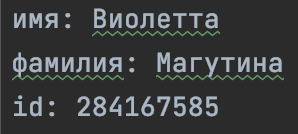

# Создание телеграм-бота с использованием VK API

## Техническое задание

Разработать телеграм бота, который принимает id пользователя из вконтакте и бот должен вывести информацию об этом пользователе.

## Результат работы

Программа успешно обрабатывает запросы пользователя. В чат выводит доступную информацию.

## Требования
- разработать чат бота
- использовать vk.api
- производить сохранение данных тех пользователей, которые были введены в чат
